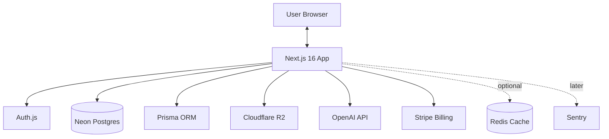
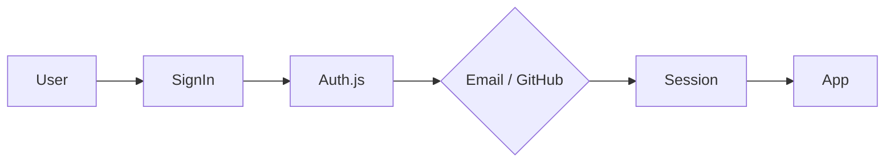
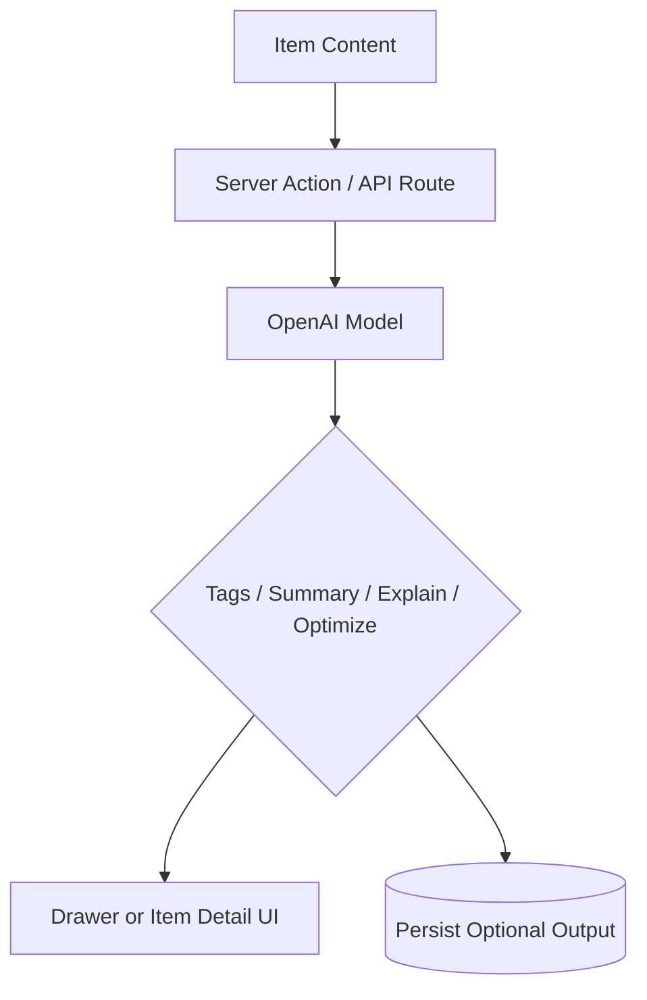
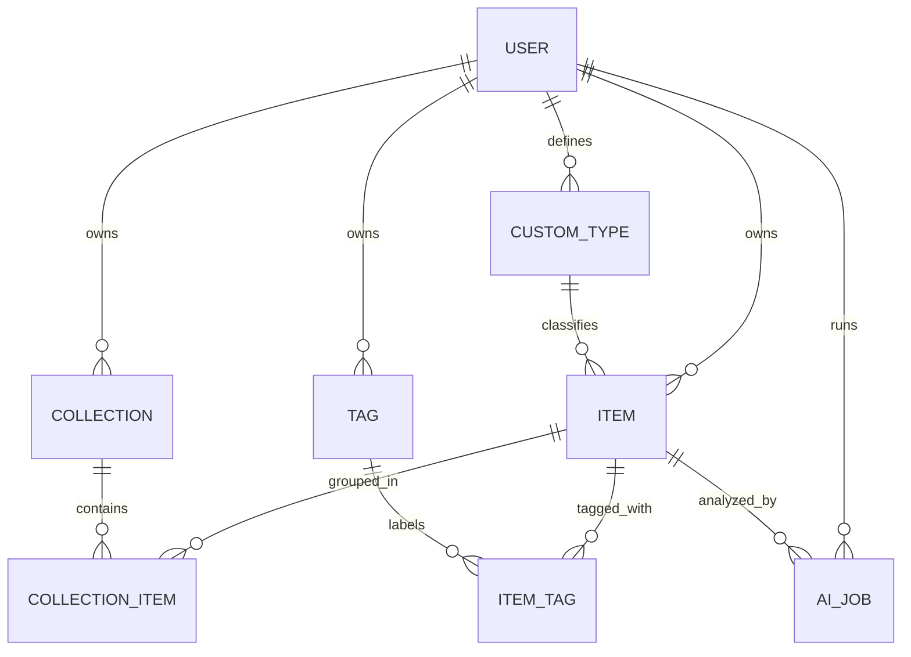

# DevStash Project Overview

> **DevStash** is a centralized developer knowledge hub for snippets, prompts, notes, commands, links, and files.
>
> **Positioning:** Store smarter. Build faster.

## 🚩 Problem

Developers keep high-value knowledge scattered across too many places:

- Code snippets in editors or notes apps
- AI prompts inside chat histories
- Context files buried in repos
- Links hidden in bookmarks
- Docs spread across folders
- Commands lost in shell history
- Templates parked in gists

This creates:

- Context switching
- Lost knowledge
- Inconsistent workflows
- Slow reuse of proven solutions

**DevStash** solves this by giving developers one fast, searchable, AI-enhanced workspace for the things they reuse every day.

## 🎯 Product Summary

### What DevStash is

DevStash is a personal developer operating system for reusable knowledge:

- Save developer resources as structured items
- Organize them into collections
- Search everything quickly
- Reuse items from a lightweight drawer-based workflow
- Add AI features on top for tagging, summarizing, explanation, and prompt refinement

### What DevStash is not

Not in MVP:

- Team collaboration
- Real-time multiplayer editing
- Public marketplace
- Browser extension
- VS Code extension
- Public API / CLI

Those are valid future expansions, but they should not complicate the first release.

## 👥 Target Users

| Persona | Main Need | Why DevStash Fits |
| --- | --- | --- |
| Everyday Developer | Fast access to saved snippets, commands, and links | Reduces repetition and context switching |
| AI-First Developer | Persistent prompts, context blocks, workflows, system messages | Gives AI work a reusable home outside chat history |
| Content Creator / Educator | Reusable notes, examples, code blocks, teaching materials | Makes course and tutorial assets easier to maintain |
| Full-Stack Builder | Patterns, boilerplates, API references, command recipes | Centralizes high-frequency engineering knowledge |

## 🧱 Core Product Concepts

### Items

An **Item** is the core unit in DevStash.

Each item has:

- a built-in **kind** that drives behavior
- an optional **custom type** for user-defined organization
- optional tags
- zero or more collections
- favorite / pinned / recent metadata

### Built-in Item Kinds

| Kind | Icon | Color | Storage Shape | Plan |
| --- | --- | --- | --- | --- |
| `snippet` | `Code` | `#3b82f6` | text | Free |
| `prompt` | `Sparkles` | `#8b5cf6` | text | Free |
| `note` | `StickyNote` | `#fde047` | text | Free |
| `command` | `Terminal` | `#f97316` | text | Free |
| `file` | `File` | `#6b7280` | file | Pro |
| `image` | `Image` | `#ec4899` | file | Pro |
| `link` | `Link` | `#10b981` | URL | Free |

### URL Structure

Human-readable item routes should stay predictable:

- `/items/snippets`
- `/items/prompts`
- `/items/notes`
- `/items/commands`
- `/items/files`
- `/items/images`
- `/items/links`

### Collections

Collections are curated groupings of mixed item kinds.

Examples:

- `React Patterns`
- `Prototype Prompts`
- `Context Files`
- `Python Snippets`

Important cleanup decision:

- **Items belong to many collections**, not just one.
- This should be modeled with a join table from the start.

## ✨ Feature Set

### MVP

- User auth: email/password and GitHub sign-in
- Item CRUD
- Built-in item kinds
- Collection CRUD
- Tags
- Favorites / pinned items
- Recently used
- Full-text search
- Markdown editing for text-based items
- Quick-create and quick-edit drawer
- Free-tier limits

### Pro

- File and image uploads
- AI auto-tag suggestions
- AI summaries
- AI explain-code
- Prompt optimization
- Export data as `JSON` / `ZIP`
- Custom item types

### Later

- Shared collections
- Team workspaces
- Browser extension
- VS Code extension
- API + CLI

## 💰 Monetization

### Free

- 50 items total
- 3 collections
- All text-based system kinds plus links
- Basic search
- No file/image uploads
- No AI features

### Pro

- $8/month or $72/year
- Unlimited items
- Unlimited collections
- File + image uploads
- AI features
- Export
- Custom item types
- Priority support

### Development Rule

During development, keep plan-gated features **unlocked behind a simple app flag** so you can build without billing friction.

## 🎨 UX Direction

### Principles

- Dark mode first
- Minimal and developer-focused
- Fast capture and fast retrieval
- Strong typography and syntax highlighting
- Subtle borders and elevation, not heavy decoration
- Visual inspiration: Notion, Linear, Raycast

### Layout

- **Sidebar**
  - Built-in item kinds
  - Favorite collections
  - Recent collections
  - Filters / tags
- **Main workspace**
  - Collection cards or item lists
  - Search results
  - Type-colored visual grouping
- **Item drawer**
  - Fast create/edit/view
  - Collection membership editing
  - Tagging
  - AI actions for Pro

### Responsive

- Desktop-first
- Sidebar becomes a drawer on mobile
- Item editor remains usable on touch devices

### Micro-interactions

- Toasts for saves / deletes / AI actions
- Skeletons while loading
- Smooth but restrained transitions
- Clear hover and focus states

### Screenshots
Refer to the screenshots below as a base for the dashboard UI. It does not have to be exact. Use it as reference:

- @context/screenshots/dashboard-ui-main.png
- @context/screenshots/dashboard-ui-drawer.png

## 🏗️ Recommended Architecture



### Architecture Notes

- Keep a **single Next.js codebase** for UI, server actions, API routes, and auth.
- Store uploaded objects in **R2** and only keep metadata in Postgres.
- Start search with **Postgres full-text search + indexes**.
- Add Redis only if a real bottleneck appears.
- Keep AI calls behind server-side endpoints only.

## 🔐 Auth Flow



## 🧠 AI Flow



## 🔎 Search Strategy

Start simple and reliable:

1. Use PostgreSQL full-text search on `title`, `description`, and text `content`.
2. Support filtering by `kind`, tags, favorites, pinned state, and collection.
3. Add trigram or fuzzy matching for title search if exact matching feels too rigid.
4. Do **not** add a separate search engine in MVP.

## 🗃️ Domain Diagram



## 🧬 Prisma Model Draft

This version cleans up the original schema in a few important ways:

- collections are many-to-many
- built-in behavior comes from `ItemKind`
- custom types are separate and optional
- uploaded files live in object storage, not in the database
- AI work is stored as jobs/results instead of being fully implicit

> **Note:** Auth.js adapter models such as `Account`, `Session`, and `VerificationToken` are intentionally omitted below to keep the domain schema focused.

```prisma
enum PlanTier {
  FREE
  PRO
}

enum ItemKind {
  SNIPPET
  PROMPT
  NOTE
  COMMAND
  FILE
  IMAGE
  LINK
}

enum ContentKind {
  TEXT
  FILE
  URL
}

enum AiJobType {
  AUTO_TAG
  SUMMARIZE
  EXPLAIN_CODE
  OPTIMIZE_PROMPT
}

enum AiJobStatus {
  PENDING
  RUNNING
  SUCCEEDED
  FAILED
}

model User {
  id                   String       @id @default(cuid())
  email                String       @unique
  name                 String?
  image                String?
  passwordHash         String?
  plan                 PlanTier     @default(FREE)
  stripeCustomerId     String?      @unique
  stripeSubscriptionId String?      @unique

  items                Item[]
  customTypes          CustomType[]
  collections          Collection[]
  tags                 Tag[]
  aiJobs               AiJob[]

  createdAt            DateTime     @default(now())
  updatedAt            DateTime     @updatedAt
}

model Item {
  id               String           @id @default(cuid())
  title            String
  kind             ItemKind
  contentKind      ContentKind
  description      String?
  content          String?          @db.Text
  sourceUrl        String?
  language         String?
  mimeType         String?
  storageKey       String?
  originalFileName String?
  fileSizeBytes    Int?
  metadata         Json?
  aiSummary        String?          @db.Text
  isFavorite       Boolean          @default(false)
  isPinned         Boolean          @default(false)
  lastViewedAt     DateTime?

  userId           String
  user             User             @relation(fields: [userId], references: [id], onDelete: Cascade)

  customTypeId     String?
  customType       CustomType?      @relation(fields: [customTypeId], references: [id], onDelete: SetNull)

  tags             ItemTag[]
  collections      CollectionItem[]
  aiJobs           AiJob[]

  createdAt        DateTime         @default(now())
  updatedAt        DateTime         @updatedAt

  @@index([userId, kind])
  @@index([userId, updatedAt])
  @@index([userId, lastViewedAt])
}

model CustomType {
  id          String       @id @default(cuid())
  name        String
  slug        String
  icon        String?
  color       String?
  baseKind    ItemKind
  isActive    Boolean      @default(true)

  userId      String
  user        User         @relation(fields: [userId], references: [id], onDelete: Cascade)

  items       Item[]

  createdAt   DateTime     @default(now())
  updatedAt   DateTime     @updatedAt

  @@unique([userId, slug])
}

model Collection {
  id          String       @id @default(cuid())
  name        String
  slug        String
  description String?
  color       String?
  icon        String?
  isFavorite  Boolean      @default(false)
  defaultKind ItemKind?

  userId      String
  user        User         @relation(fields: [userId], references: [id], onDelete: Cascade)

  items       CollectionItem[]

  createdAt   DateTime     @default(now())
  updatedAt   DateTime     @updatedAt

  @@unique([userId, slug])
}

model CollectionItem {
  collectionId String
  itemId       String
  position     Int?
  addedAt      DateTime    @default(now())

  collection   Collection  @relation(fields: [collectionId], references: [id], onDelete: Cascade)
  item         Item        @relation(fields: [itemId], references: [id], onDelete: Cascade)

  @@id([collectionId, itemId])
  @@index([itemId])
}

model Tag {
  id         String       @id @default(cuid())
  name       String
  slug       String
  color      String?

  userId     String
  user       User         @relation(fields: [userId], references: [id], onDelete: Cascade)

  items      ItemTag[]

  createdAt  DateTime     @default(now())
  updatedAt  DateTime     @updatedAt

  @@unique([userId, slug])
}

model ItemTag {
  itemId     String
  tagId      String

  item       Item         @relation(fields: [itemId], references: [id], onDelete: Cascade)
  tag        Tag          @relation(fields: [tagId], references: [id], onDelete: Cascade)

  @@id([itemId, tagId])
  @@index([tagId])
}

model AiJob {
  id            String       @id @default(cuid())
  type          AiJobType
  status        AiJobStatus  @default(PENDING)
  model         String       @default("gpt-5.4-nano")
  promptVersion String?
  result        Json?
  error         String?
  startedAt     DateTime?
  completedAt   DateTime?

  userId        String
  user          User         @relation(fields: [userId], references: [id], onDelete: Cascade)

  itemId        String
  item          Item         @relation(fields: [itemId], references: [id], onDelete: Cascade)

  createdAt     DateTime     @default(now())
  updatedAt     DateTime     @updatedAt

  @@index([userId, status])
  @@index([itemId, type])
}
```

## 🧠 Data Modeling Decisions Worth Keeping

- **`ItemKind` drives system behavior.** This keeps built-in rules stable.
- **`CustomType` is optional metadata.** It supports Pro differentiation without making the whole app dynamic.
- **`CollectionItem` is explicit.** This preserves many-to-many membership and future ordering.
- **`lastViewedAt` is enough for recent items in MVP.** No extra analytics table needed yet.
- **R2 keys live in the DB, files do not.**
- **Plan enforcement belongs in application logic**, not as hard database constraints.

## 🛠️ Engineering Notes

- Use **Prisma Migrate**, never `db push`, for schema changes.
- Use signed upload / download patterns for private R2 assets.
- Keep AI model names configurable through environment variables.
- Store AI outputs only when they materially improve UX or reduce cost.
- Prefer server actions for simple item mutations; use route handlers where uploads or external integrations need clearer boundaries.

## 📍 Current Repo State

As of **April 24, 2026**, this repo already includes:

- `next@16.2.4`
- `react@19.2.4`
- `tailwindcss@4`

Still to be added for the full product foundation:

- Prisma + `@prisma/client`
- Auth.js integration
- Neon database setup
- Cloudflare R2 integration
- Stripe billing setup
- OpenAI integration
- shadcn/ui setup

## 🗺️ Suggested Delivery Phases

### Phase 1: Foundation

- App shell
- Auth
- Prisma schema + migrations
- Item CRUD
- Collection CRUD
- Tags

### Phase 2: Retrieval

- Search
- Favorites / pinned / recent
- Drawer UX
- Syntax highlighting

### Phase 3: Pro Foundation

- Stripe product model
- Plan enforcement
- File / image uploads
- Export

### Phase 4: AI Layer

- Auto-tagging
- Summaries
- Explain code
- Prompt optimizer

## 🤖 AI Model Recommendation

Use `gpt-5.4-nano` as the default small model for DevStash.

Why:

- It is the current GPT-5.4 small-model option for fast, cost-sensitive workloads.
- It is a better starting point for a new build than the older `gpt-5-nano`.
- The exact model name should still be configurable through environment variables.

## 🔗 Reference Links

- [Next.js Docs](https://nextjs.org/docs)
- [Prisma ORM Docs](https://docs.prisma.io/docs/orm)
- [Prisma ORM v7 Upgrade Guide](https://docs.prisma.io/docs/guides/upgrade-prisma-orm/v7)
- [Neon Docs](https://neon.com/docs/introduction)
- [Auth.js](https://authjs.dev/)
- [Cloudflare R2 Docs](https://developers.cloudflare.com/r2/)
- [Tailwind CSS Docs](https://tailwindcss.com/docs/installation/using-postcss)
- [shadcn/ui Docs](https://ui.shadcn.com/docs)
- [OpenAI GPT-5.4 nano](https://developers.openai.com/api/docs/models/gpt-5.4-nano/)
- [Stripe Subscriptions Docs](https://docs.stripe.com/payments/subscriptions)
- [Vercel Deployments Docs](https://vercel.com/docs/deployments)

## ✅ Final Recommendation

The strongest MVP for DevStash is:

- **single-user first**
- **collections + tags + search first**
- **file uploads and AI second**
- **custom item types after the base system feels solid**

That gives you a product that is coherent, shippable, and easy to explain without overbuilding too early.
